# URL Shortener

[](https://nodejs.org)
[](LICENSE)

A production-oriented URL shortening platform built with React, Node.js, Express, MongoDB, and Redis.

Create short URLs, manage links, track click analytics, generate QR codes, and monitor traffic through a centralized dashboard. Designed for scalability, maintainability, and production deployment.

---

## Table of Contents

- [Getting Started](#getting-started)
- [Environment Variables](#environment-variables)
- [Features](#features)
- [Architecture](#architecture)
- [API Reference](#api-reference)
- [Database Design](#database-design)
- [Deployment](#deployment)
- [Roadmap](#roadmap)

---

## Getting Started

### Prerequisites

- Node.js 18+
- Docker and Docker Compose
- MongoDB 6+ (or use the Docker setup)
- Redis 7+ (or use the Docker setup)

### Local Development (Docker)

```bash
# Clone the repository
git clone https://github.com/sayyed-anwar/url-shortener.git
cd url-shortener

# Copy environment files
cp backend/.env.example backend/.env
cp frontend/.env.example frontend/.env

# Start all services
docker-compose up --build
```

Frontend: http://localhost:5173  
Backend API: http://localhost:5000  
MongoDB: localhost:27017  
Redis: localhost:6379

### Manual Setup

```bash
# Backend
cd backend
npm install
npm run dev

# Frontend (new terminal)
cd frontend
npm install
npm run dev
```

---

## Environment Variables

### Backend (`backend/.env`)

| Variable         | Description                       | Example                                  |
| ---------------- | --------------------------------- | ---------------------------------------- |
| `PORT`           | Server port                       | `5000`                                   |
| `MONGO_URI`      | MongoDB connection string         | `mongodb://localhost:27017/urlshortener` |
| `REDIS_URL`      | Redis connection string           | `redis://localhost:6379`                 |
| `JWT_SECRET`     | JWT signing secret (min 32 chars) | `your_secret_here`                       |
| `JWT_EXPIRES_IN` | JWT expiry duration               | `7d`                                     |
| `BASE_URL`       | Public base URL for short links   | `http://localhost:5000`                  |
| `NODE_ENV`       | Environment                       | `development`                            |

### Frontend (`frontend/.env`)

| Variable              | Description                          | Example                     |
| --------------------- | ------------------------------------ | --------------------------- |
| `VITE_API_URL`        | Backend API URL                      | `http://localhost:5000/api` |
| `VITE_SHORT_BASE_URL` | Base URL shown in UI for short links | `http://localhost:5000`     |

---

## Features

### Core

| Feature             | Description                                           |
| ------------------- | ----------------------------------------------------- |
| URL Shortening      | Convert long URLs into compact short links via NanoID |
| URL Redirection     | Redirect users with minimal latency via Redis cache   |
| Custom Aliases      | Let users choose their own short codes                |
| URL Expiration      | Expire links after a configurable date                |
| Link Management     | Create, edit, delete, and manage URLs                 |
| Click Tracking      | Track total link visits                               |
| Analytics Dashboard | View detailed statistics                              |

### Advanced

| Feature            | Description                                         |
| ------------------ | --------------------------------------------------- |
| Authentication     | JWT-based auth with bcrypt password hashing         |
| QR Code Generation | Generate QR codes for any short link                |
| Redis Caching      | Sub-millisecond lookups for hot URLs                |
| Rate Limiting      | Per-IP rate limiting via express-rate-limit         |
| Device Analytics   | Track device type per click                         |
| Browser Analytics  | Track browser per click                             |
| Geo Analytics      | Track country and city via IP geolocation           |
| Docker Support     | Full containerized setup via Docker Compose         |
| CI/CD Pipeline     | Automated testing and deployment via GitHub Actions |

---

## Architecture

### High-Level

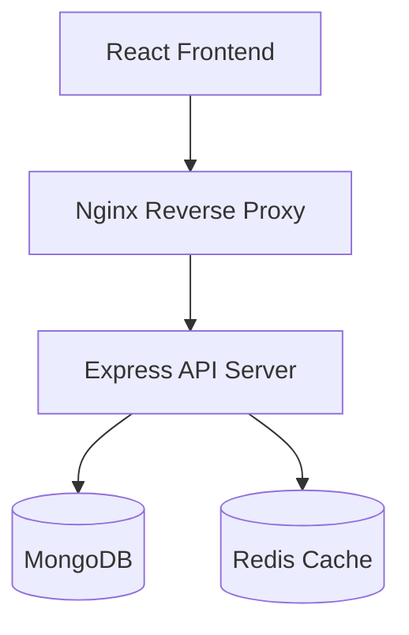

### Backend Layers

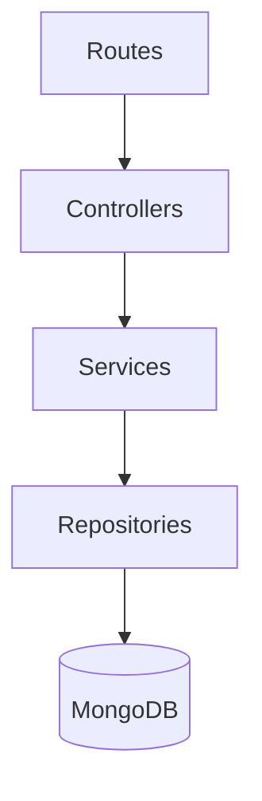

### URL Redirection Flow

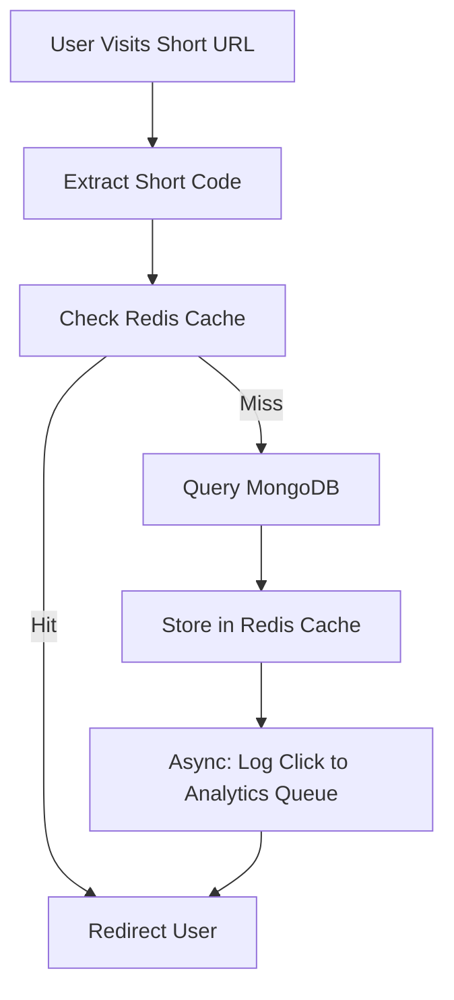

> **Note:** Analytics logging is handled asynchronously after the redirect response is sent. This keeps redirect latency minimal even under high traffic.

### URL Creation Flow

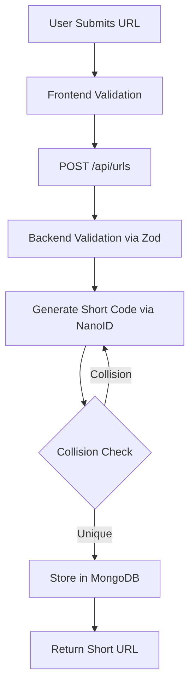

### Analytics Collection Flow

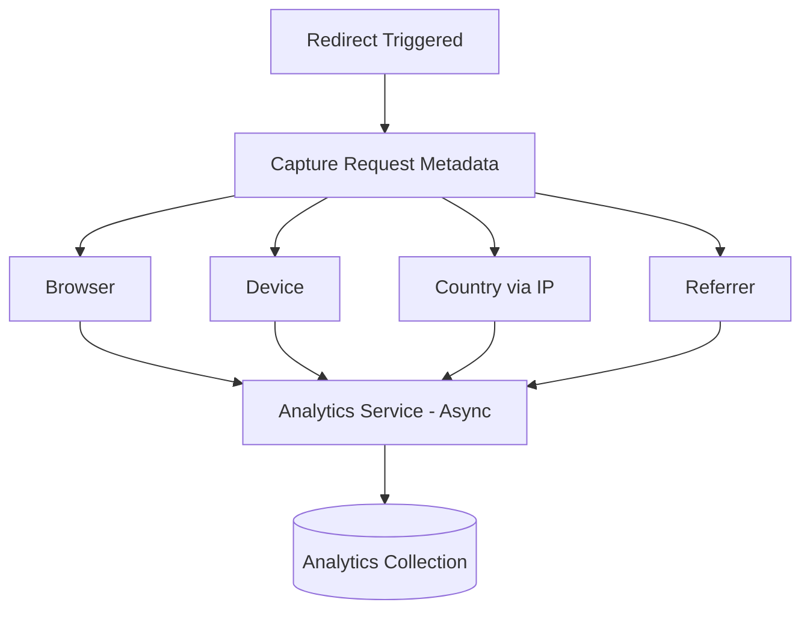

---

## Project Structure

```text
url-shortener/
├── backend/
├── frontend/
├── docs/
├── docker/
├── .github/
├── docker-compose.yml
├── README.md
└── .gitignore
```

### Backend

```text
backend/
├── src/
│   ├── config/
│   │   ├── database.js         # MongoDB connection
│   │   ├── redis.js            # Redis client
│   │   └── env.js              # Environment variable validation
│   │
│   ├── controllers/            # Request/response handling
│   ├── services/               # Business logic
│   ├── repositories/           # Data access layer
│   ├── routes/
│   │   ├── auth.routes.js
│   │   ├── url.routes.js
│   │   ├── analytics.routes.js
│   │   └── redirect.routes.js  # /:shortCode — kept separate for performance
│   │
│   ├── middlewares/
│   │   ├── auth.middleware.js
│   │   ├── error.middleware.js
│   │   ├── validate.middleware.js
│   │   └── rateLimiter.middleware.js
│   │
│   ├── validators/             # Zod schemas
│   ├── models/                 # Mongoose models
│   ├── cache/
│   │   └── redisCache.js       # Cache get/set/invalidate helpers
│   │
│   ├── jobs/
│   │   ├── deleteExpiredUrls.job.js        # Cron: purge expired links
│   │   └── analyticsAggregation.job.js     # Cron: aggregate click stats
│   │
│   └── utils/
│       ├── generateShortCode.js  # NanoID with collision retry
│       ├── extractDeviceInfo.js
│       ├── geoLocation.js
│       └── logger.js
│
└── tests/
    ├── integration/
    └── unit/
```

### Frontend

```text
frontend/
└── src/
    ├── api/              # Axios instance + TanStack Query client
    ├── components/
    │   ├── common/
    │   ├── forms/
    │   ├── analytics/
    │   ├── layout/
    │   └── url/
    ├── pages/            # Home, Dashboard, Analytics, Login, Register, NotFound
    ├── hooks/            # useAuth, useUrls, useAnalytics
    ├── services/         # API call wrappers
    ├── routes/           # AppRoutes, ProtectedRoute, PublicRoute
    ├── context/          # AuthContext
    └── utils/            # copyToClipboard, formatDate, generateQrCode
```

---

## Database Design

### Users

```json
{
  "_id": "ObjectId",
  "name": "string",
  "email": "string (unique, indexed)",
  "password": "string (bcrypt hash)",
  "createdAt": "Date"
}
```

### URLs

```json
{
  "_id": "ObjectId",
  "userId": "ObjectId (ref: Users)",
  "originalUrl": "string",
  "shortCode": "string (unique index, 7 chars, NanoID)",
  "customAlias": "string | null (unique sparse index)",
  "expiresAt": "Date | null",
  "clickCount": "number (default: 0)",
  "isActive": "boolean (default: true)",
  "createdAt": "Date"
}
```

### Analytics

```json
{
  "_id": "ObjectId",
  "urlId": "ObjectId (ref: URLs, indexed)",
  "country": "string",
  "city": "string",
  "browser": "string",
  "device": "string",
  "os": "string",
  "referrer": "string",
  "timestamp": "Date (TTL index: 90 days)"
}
```

> **Indexes:** `urlId + timestamp` compound index for analytics queries. TTL index on `timestamp` for automatic data expiry. `shortCode` unique index with partial filter for active URLs.

---

## API Reference

### Authentication

| Method | Endpoint             | Auth | Description        |
| ------ | -------------------- | ---- | ------------------ |
| POST   | `/api/auth/register` | —    | Create account     |
| POST   | `/api/auth/login`    | —    | Login, returns JWT |
| GET    | `/api/auth/profile`  | ✓    | Get current user   |

### URL Management

| Method | Endpoint        | Auth | Description                  |
| ------ | --------------- | ---- | ---------------------------- |
| POST   | `/api/urls`     | ✓    | Create short URL             |
| GET    | `/api/urls`     | ✓    | List user's URLs (paginated) |
| GET    | `/api/urls/:id` | ✓    | Get single URL               |
| PUT    | `/api/urls/:id` | ✓    | Update URL                   |
| DELETE | `/api/urls/:id` | ✓    | Delete URL                   |

### Analytics

| Method | Endpoint                   | Auth | Description                |
| ------ | -------------------------- | ---- | -------------------------- |
| GET    | `/api/analytics/:urlId`    | ✓    | Per-link analytics         |
| GET    | `/api/analytics/dashboard` | ✓    | Aggregated dashboard stats |

### Redirect

| Method | Endpoint      | Auth | Description                        |
| ------ | ------------- | ---- | ---------------------------------- |
| GET    | `/:shortCode` | —    | Redirect + async analytics capture |

---

## Redis Caching Strategy

Cache structure — key: `url:{shortCode}`, value: original URL string.

```
SET url:abc123 "https://example.com" EX 86400
```

- TTL: 24 hours (refreshed on each cache hit)
- On URL delete/update: cache key is invalidated immediately
- Cache miss triggers DB lookup and re-population

**Impact:** Redirects serve from Redis in ~1–2ms vs ~15–30ms from MongoDB.

---

## Security

| Layer            | Implementation                            |
| ---------------- | ----------------------------------------- | --------------- |
| Authentication   | JWT (RS256)                               |
| Password Storage | bcrypt (rounds: 12)                       |
| Input Validation | Zod                                       |
| Rate Limiting    | express-rate-limit (100 req/15min per IP) |
| HTTP Security    | Helmet                                    | # URL Shortener |

A production-oriented URL shortening platform built with React, Node.js, Express, MongoDB, and Redis.

The application enables users to create short URLs, manage links, track click analytics, generate QR codes, and monitor traffic through a centralized dashboard. The system is designed with scalability, maintainability, and production deployment in mind.

---

## Objectives

- Generate short and unique URLs
- Redirect users with minimal latency
- Track click analytics and user behavior
- Support custom aliases and link expiration
- Scale efficiently under high traffic
- Follow clean architecture principles

---

# Features

## Core Features

| Feature             | Description                                 |
| ------------------- | ------------------------------------------- |
| URL Shortening      | Convert long URLs into compact short links  |
| URL Redirection     | Redirect users to original destinations     |
| Custom Aliases      | Allow users to choose their own short codes |
| URL Expiration      | Expire links after a configurable date      |
| Link Management     | Create, edit, delete, and manage URLs       |
| Click Tracking      | Track total link visits                     |
| Analytics Dashboard | View detailed statistics                    |

---

## Advanced Features

| Feature            | Description                        |
| ------------------ | ---------------------------------- |
| Authentication     | JWT-based authentication           |
| QR Code Generation | Generate QR codes for links        |
| Redis Caching      | Cache frequently accessed URLs     |
| Rate Limiting      | Prevent abuse and bot traffic      |
| Device Analytics   | Track device information           |
| Browser Analytics  | Track browser usage                |
| Geo Analytics      | Track country and city information |
| Docker Support     | Containerized deployment           |
| CI/CD Pipeline     | Automated testing and deployment   |

---

# High-Level Architecture

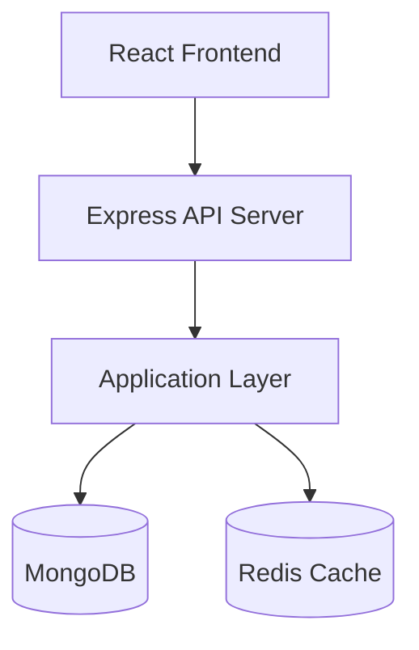

---

# System Design

## URL Creation Flow

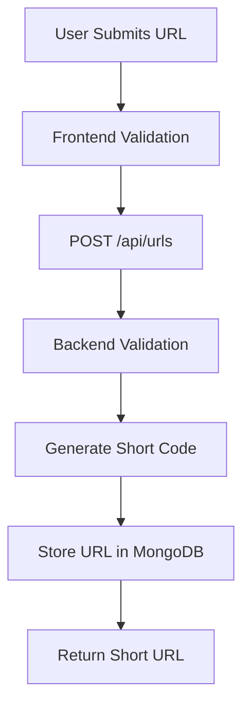

---

## URL Redirection Flow

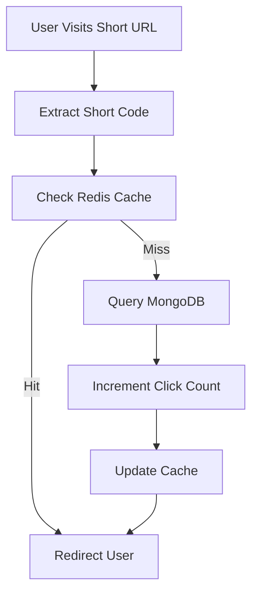

---

## Analytics Collection Flow

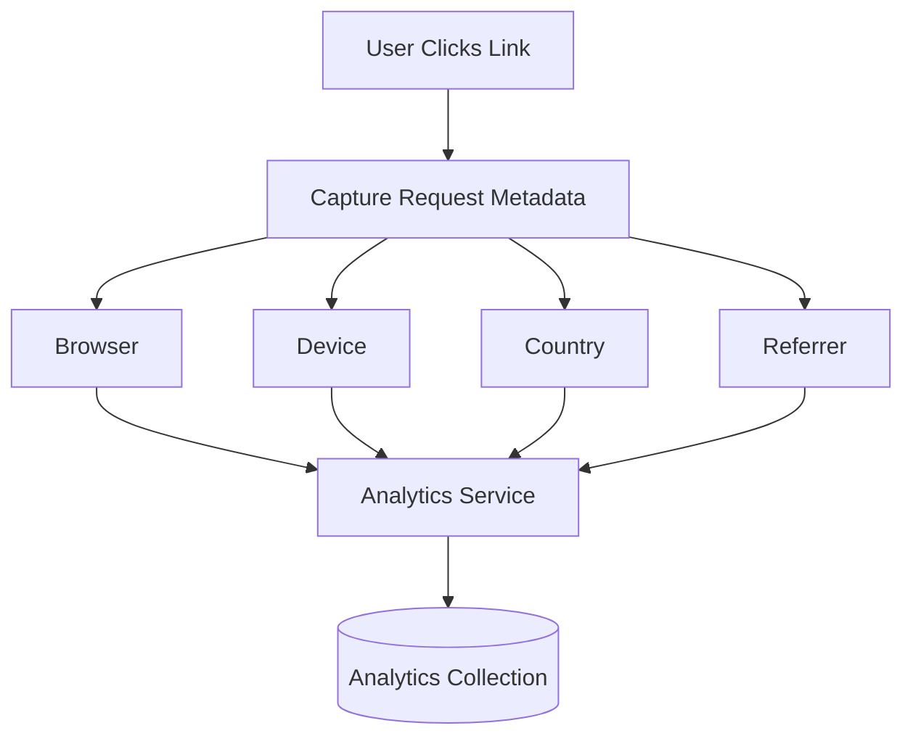

---

# Project Structure

```text
url-shortener/
│
├── backend/
├── frontend/
├── docs/
├── docker/
├── .github/
│
├── docker-compose.yml
├── README.md
└── .gitignore
```

---

# Backend Architecture

```text
backend/
│
├── src/
│   │
│   ├── config/
│   │   ├── database.js
│   │   ├── redis.js
│   │   └── env.js
│   │
│   ├── controllers/
│   │   ├── auth.controller.js
│   │   ├── url.controller.js
│   │   └── analytics.controller.js
│   │
│   ├── services/
│   │   ├── auth.service.js
│   │   ├── url.service.js
│   │   └── analytics.service.js
│   │
│   ├── repositories/
│   │   ├── user.repository.js
│   │   ├── url.repository.js
│   │   └── analytics.repository.js
│   │
│   ├── routes/
│   │   ├── auth.routes.js
│   │   ├── url.routes.js
│   │   ├── analytics.routes.js
│   │   └── redirect.routes.js
│   │
│   ├── middlewares/
│   │   ├── auth.middleware.js
│   │   ├── error.middleware.js
│   │   ├── validate.middleware.js
│   │   └── rateLimiter.middleware.js
│   │
│   ├── validators/
│   │   ├── auth.validator.js
│   │   └── url.validator.js
│   │
│   ├── models/
│   │   ├── User.js
│   │   ├── Url.js
│   │   └── Analytics.js
│   │
│   ├── cache/
│   │   └── redisCache.js
│   │
│   ├── jobs/
│   │   ├── deleteExpiredUrls.job.js
│   │   └── analyticsAggregation.job.js
│   │
│   ├── utils/
│   │   ├── generateShortCode.js
│   │   ├── extractDeviceInfo.js
│   │   ├── geoLocation.js
│   │   └── logger.js
│   │
│   ├── constants/
│   │   ├── httpStatus.js
│   │   └── messages.js
│   │
│   ├── app.js
│   └── server.js
│
├── tests/
│   ├── integration/
│   └── unit/
│
├── docs/
│
├── .env
├── .env.example
├── package.json
└── README.md
```

---

# Frontend Architecture

```text
frontend/
│
├── public/
│
├── src/
│   │
│   ├── api/
│   │   ├── axios.js
│   │   └── queryClient.js
│   │
│   ├── assets/
│   │   ├── images/
│   │   ├── icons/
│   │   └── logos/
│   │
│   ├── components/
│   │   ├── common/
│   │   ├── forms/
│   │   ├── analytics/
│   │   ├── layout/
│   │   └── url/
│   │
│   ├── pages/
│   │   ├── Home/
│   │   ├── Dashboard/
│   │   ├── Analytics/
│   │   ├── Login/
│   │   ├── Register/
│   │   └── NotFound/
│   │
│   ├── hooks/
│   │   ├── useAuth.js
│   │   ├── useUrls.js
│   │   └── useAnalytics.js
│   │
│   ├── services/
│   │   ├── auth.service.js
│   │   ├── url.service.js
│   │   └── analytics.service.js
│   │
│   ├── routes/
│   │   ├── AppRoutes.jsx
│   │   ├── ProtectedRoute.jsx
│   │   └── PublicRoute.jsx
│   │
│   ├── context/
│   │   └── AuthContext.jsx
│   │
│   ├── utils/
│   │   ├── copyToClipboard.js
│   │   ├── formatDate.js
│   │   └── generateQrCode.js
│   │
│   ├── constants/
│   │   ├── api.js
│   │   └── routes.js
│   │
│   ├── styles/
│   │
│   ├── App.jsx
│   └── main.jsx
│
├── .env
├── package.json
├── vite.config.js
└── README.md
```

---

# Database Design

## Users Collection

```json
{
  "_id": "ObjectId",
  "name": "John Doe",
  "email": "john@example.com",
  "password": "hashed_password",
  "createdAt": "Date"
}
```

---

## URLs Collection

```json
{
  "_id": "ObjectId",
  "userId": "ObjectId",
  "originalUrl": "https://example.com",
  "shortCode": "abc123",
  "customAlias": null,
  "expiresAt": null,
  "clickCount": 0,
  "createdAt": "Date"
}
```

---

## Analytics Collection

```json
{
  "_id": "ObjectId",
  "urlId": "ObjectId",
  "country": "India",
  "city": "Delhi",
  "browser": "Chrome",
  "device": "Desktop",
  "os": "Windows",
  "referrer": "Google",
  "timestamp": "Date"
}
```

---

# API Design

## Authentication

| Method | Endpoint             |
| ------ | -------------------- |
| POST   | `/api/auth/register` |
| POST   | `/api/auth/login`    |
| GET    | `/api/auth/profile`  |

---

## URL Management

| Method | Endpoint        |
| ------ | --------------- |
| POST   | `/api/urls`     |
| GET    | `/api/urls`     |
| GET    | `/api/urls/:id` |
| PUT    | `/api/urls/:id` |
| DELETE | `/api/urls/:id` |

---

## Analytics

| Method | Endpoint                   |
| ------ | -------------------------- |
| GET    | `/api/analytics/:urlId`    |
| GET    | `/api/analytics/dashboard` |

---

## Redirect

| Method | Endpoint      |
| ------ | ------------- |
| GET    | `/:shortCode` |

---

# Layered Backend Architecture


---

# Redis Caching Strategy

## Cache Structure

```json
{
  "abc123": {
    "originalUrl": "https://google.com"
  }
}
```

### Benefits

- Faster redirects
- Reduced database queries
- Improved scalability
- Better response times

---

# Security Considerations

| Security Layer   | Implementation     |
| ---------------- | ------------------ |
| Authentication   | JWT                |
| Password Storage | bcrypt             |
| Input Validation | Zod                |
| Rate Limiting    | express-rate-limit |
| HTTP Security    | Helmet             |
| CORS             | Controlled Origins |
| XSS Protection   | Sanitization       |
| CSRF Protection  | Tokens             |

---

# Frontend Pages

## Public Pages

- Home
- Login
- Register

## Protected Pages

- Dashboard
- Analytics
- Profile
- Settings

---

# Technology Stack

## Frontend

- React
- Vite
- Tailwind CSS
- Axios
- TanStack Query

## Backend

- Node.js
- Express.js
- MongoDB
- Mongoose
- Redis
- JWT
- NanoID

## DevOps

- Docker
- Nginx
- GitHub Actions

---

# Scalability Considerations

## URL Collision

Solution:

- NanoID
- Database unique indexes

## High Traffic Redirects

Solution:

- Redis caching layer

## Analytics Growth

Solution:

- Dedicated analytics collection
- Aggregated reporting

## Database Scaling

Solution:

- Read replicas
- Horizontal scaling

---

# Production Deployment Architecture

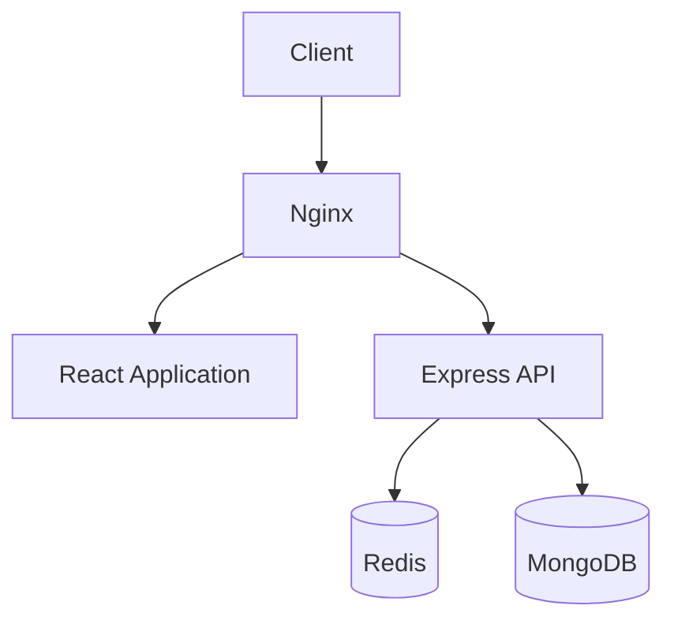

---

# Future Enhancements

- Team Workspaces
- Password Protected Links
- Scheduled Publishing
- UTM Builder
- Bulk URL Import
- Public Analytics Sharing
- Deep Linking Support
- Event Streaming with Kafka
- Multi-Tenant Architecture

---

# Development Roadmap

## Phase 1

- URL Shortening
- URL Redirection
- CRUD Operations

## Phase 2

- Authentication
- Dashboard

## Phase 3

- Analytics

## Phase 4

- Redis Integration

## Phase 5

- Dockerization

## Phase 6

- CI/CD Pipeline

## Phase 7

- Horizontal Scaling & Performance Optimization

```

```

| CORS | Allowlisted origins via env config |
| XSS Protection | Input sanitization |
| CSRF Protection | SameSite cookie + CSRF token |

---

## Deployment

### Production Architecture

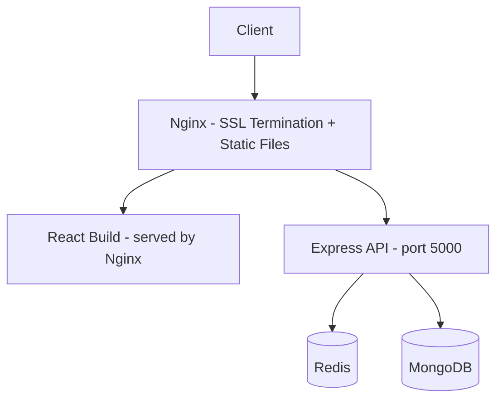

### Docker Compose

```bash
docker-compose -f docker-compose.yml up -d
```

Services: `frontend`, `backend`, `mongo`, `redis`, `nginx`

### CI/CD

GitHub Actions pipeline on push to `main`:

1. Run unit and integration tests
2. Build Docker images
3. Push to registry
4. Deploy to server via SSH

---

## Scalability Notes

| Concern                | Current Approach                          | At Scale                                 |
| ---------------------- | ----------------------------------------- | ---------------------------------------- |
| Short code collisions  | NanoID + unique index + retry             | Acceptable at current scale              |
| High redirect traffic  | Redis caching layer                       | Add read replicas; consider CDN          |
| Analytics write volume | Async post-redirect logging               | Move to queue (BullMQ/Kafka) at 10k+ rps |
| MongoDB growth         | Separate analytics collection + TTL index | Horizontal sharding on `urlId`           |

---

## Roadmap

### Active

- [ ] Phase 1: URL shortening, redirection, CRUD
- [ ] Phase 2: Authentication, dashboard
- [ ] Phase 3: Analytics

### Planned

- [ ] Phase 4: Redis integration
- [ ] Phase 5: Dockerization
- [ ] Phase 6: CI/CD pipeline
- [ ] Phase 7: Horizontal scaling

### Backlog

- Password-protected links
- UTM builder
- Bulk URL import
- Team workspaces

---

## License

MIT
