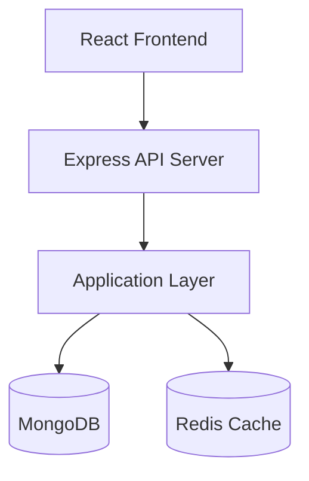
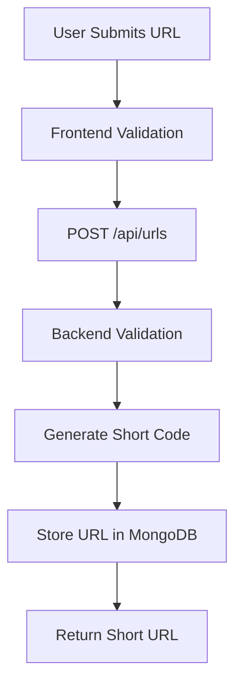
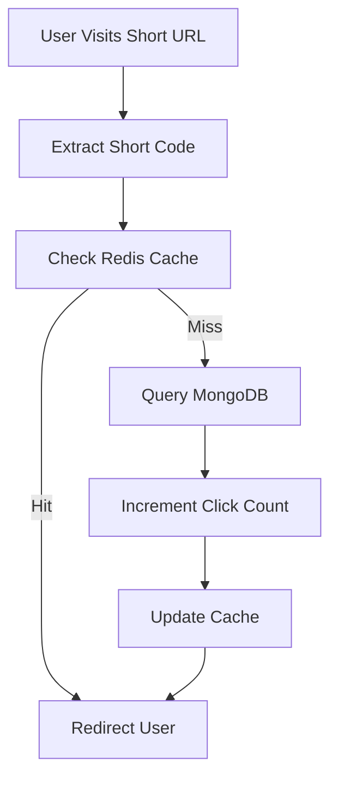
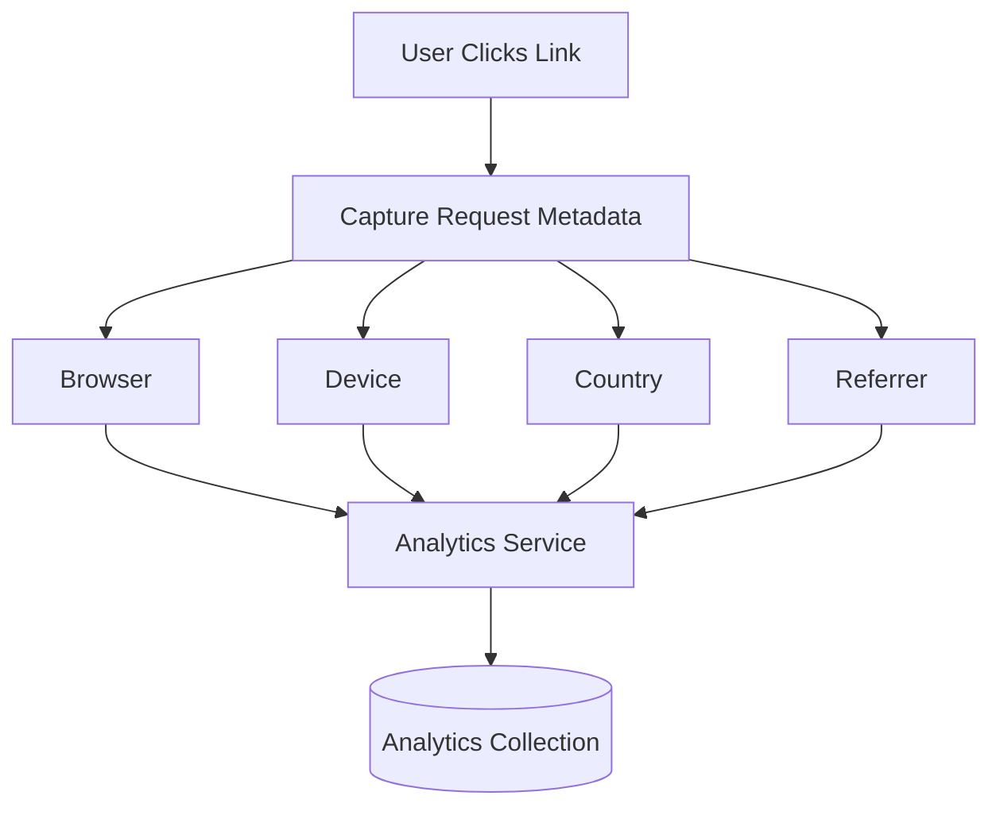
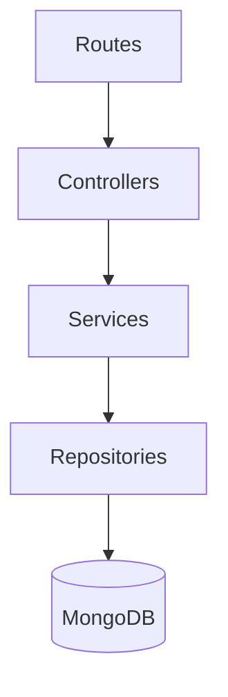
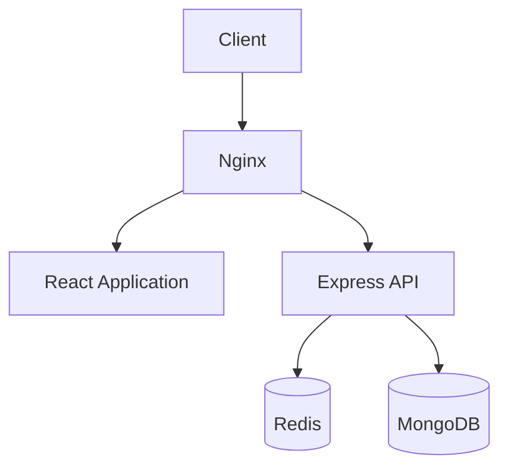

# URL Shortener

A production-oriented URL shortening platform built with React, Node.js, Express, MongoDB, and Redis.

The application enables users to create short URLs, manage links, track click analytics, generate QR codes, and monitor traffic through a centralized dashboard. The system is designed with scalability, maintainability, and production deployment in mind.

---

## Objectives

- Generate short and unique URLs
- Redirect users with minimal latency
- Track click analytics and user behavior
- Support custom aliases and link expiration
- Scale efficiently under high traffic
- Follow clean architecture principles

---

# Features

## Core Features

| Feature             | Description                                 |
| ------------------- | ------------------------------------------- |
| URL Shortening      | Convert long URLs into compact short links  |
| URL Redirection     | Redirect users to original destinations     |
| Custom Aliases      | Allow users to choose their own short codes |
| URL Expiration      | Expire links after a configurable date      |
| Link Management     | Create, edit, delete, and manage URLs       |
| Click Tracking      | Track total link visits                     |
| Analytics Dashboard | View detailed statistics                    |

---

## Advanced Features

| Feature            | Description                        |
| ------------------ | ---------------------------------- |
| Authentication     | JWT-based authentication           |
| QR Code Generation | Generate QR codes for links        |
| Redis Caching      | Cache frequently accessed URLs     |
| Rate Limiting      | Prevent abuse and bot traffic      |
| Device Analytics   | Track device information           |
| Browser Analytics  | Track browser usage                |
| Geo Analytics      | Track country and city information |
| Docker Support     | Containerized deployment           |
| CI/CD Pipeline     | Automated testing and deployment   |

---

# High-Level Architecture



---

# System Design

## URL Creation Flow



---

## URL Redirection Flow



---

## Analytics Collection Flow



---

# Project Structure

```text
url-shortener/
│
├── backend/
├── frontend/
├── docs/
├── docker/
├── .github/
│
├── docker-compose.yml
├── README.md
└── .gitignore
```

---

# Backend Architecture

```text
backend/
│
├── src/
│   ├── config/
│   ├── controllers/
│   ├── services/
│   ├── repositories/
│   ├── routes/
│   ├── middlewares/
│   ├── validators/
│   ├── models/
│   ├── cache/
│   ├── jobs/
│   ├── utils/
│   ├── constants/
│   │
│   ├── app.js
│   └── server.js
│
├── tests/
├── package.json
└── .env
```

---

# Frontend Architecture

```text
frontend/
│
├── src/
│   ├── api/
│   ├── components/
│   ├── pages/
│   ├── layouts/
│   ├── hooks/
│   ├── services/
│   ├── routes/
│   ├── store/
│   ├── utils/
│   ├── constants/
│   ├── styles/
│   │
│   ├── App.jsx
│   └── main.jsx
│
├── public/
└── package.json
```

---

# Database Design

## Users Collection

```json
{
  "_id": "ObjectId",
  "name": "John Doe",
  "email": "john@example.com",
  "password": "hashed_password",
  "createdAt": "Date"
}
```

---

## URLs Collection

```json
{
  "_id": "ObjectId",
  "userId": "ObjectId",
  "originalUrl": "https://example.com",
  "shortCode": "abc123",
  "customAlias": null,
  "expiresAt": null,
  "clickCount": 0,
  "createdAt": "Date"
}
```

---

## Analytics Collection

```json
{
  "_id": "ObjectId",
  "urlId": "ObjectId",
  "country": "India",
  "city": "Delhi",
  "browser": "Chrome",
  "device": "Desktop",
  "os": "Windows",
  "referrer": "Google",
  "timestamp": "Date"
}
```

---

# API Design

## Authentication

| Method | Endpoint             |
| ------ | -------------------- |
| POST   | `/api/auth/register` |
| POST   | `/api/auth/login`    |
| GET    | `/api/auth/profile`  |

---

## URL Management

| Method | Endpoint        |
| ------ | --------------- |
| POST   | `/api/urls`     |
| GET    | `/api/urls`     |
| GET    | `/api/urls/:id` |
| PUT    | `/api/urls/:id` |
| DELETE | `/api/urls/:id` |

---

## Analytics

| Method | Endpoint                   |
| ------ | -------------------------- |
| GET    | `/api/analytics/:urlId`    |
| GET    | `/api/analytics/dashboard` |

---

## Redirect

| Method | Endpoint      |
| ------ | ------------- |
| GET    | `/:shortCode` |

---

# Layered Backend Architecture



---

# Redis Caching Strategy

## Cache Structure

```json
{
  "abc123": {
    "originalUrl": "https://google.com"
  }
}
```

### Benefits

- Faster redirects
- Reduced database queries
- Improved scalability
- Better response times

---

# Security Considerations

| Security Layer   | Implementation     |
| ---------------- | ------------------ |
| Authentication   | JWT                |
| Password Storage | bcrypt             |
| Input Validation | Zod                |
| Rate Limiting    | express-rate-limit |
| HTTP Security    | Helmet             |
| CORS             | Controlled Origins |
| XSS Protection   | Sanitization       |
| CSRF Protection  | Tokens             |

---

# Frontend Pages

## Public Pages

- Home
- Login
- Register

## Protected Pages

- Dashboard
- Analytics
- Profile
- Settings

---

# Technology Stack

## Frontend

- React
- Vite
- Tailwind CSS
- Axios
- TanStack Query

## Backend

- Node.js
- Express.js
- MongoDB
- Mongoose
- Redis
- JWT
- NanoID

## DevOps

- Docker
- Nginx
- GitHub Actions

---

# Scalability Considerations

## URL Collision

Solution:

- NanoID
- Database unique indexes

## High Traffic Redirects

Solution:

- Redis caching layer

## Analytics Growth

Solution:

- Dedicated analytics collection
- Aggregated reporting

## Database Scaling

Solution:

- Read replicas
- Horizontal scaling

---

# Production Deployment Architecture



---

# Future Enhancements

- Team Workspaces
- Password Protected Links
- Scheduled Publishing
- UTM Builder
- Bulk URL Import
- Public Analytics Sharing
- Deep Linking Support
- Event Streaming with Kafka
- Multi-Tenant Architecture

---

# Development Roadmap

## Phase 1

- URL Shortening
- URL Redirection
- CRUD Operations

## Phase 2

- Authentication
- Dashboard

## Phase 3

- Analytics

## Phase 4

- Redis Integration

## Phase 5

- Dockerization

## Phase 6

- CI/CD Pipeline

## Phase 7

- Horizontal Scaling & Performance Optimization

```

```
