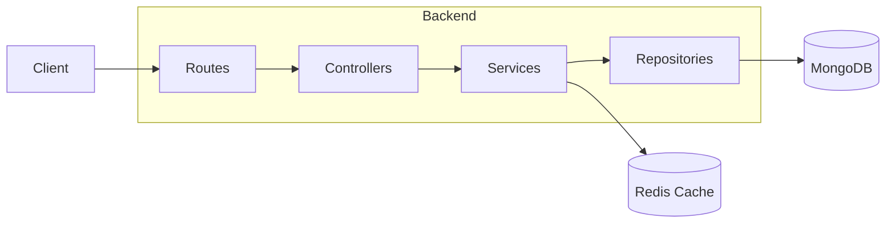
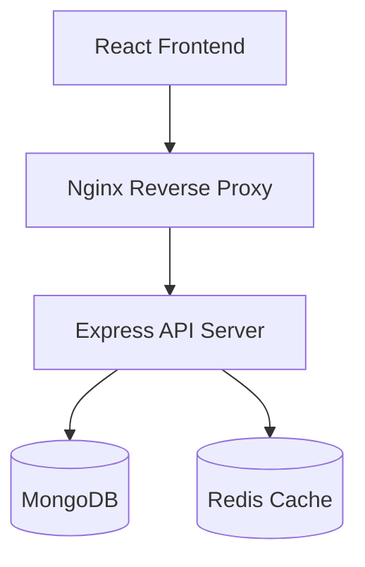
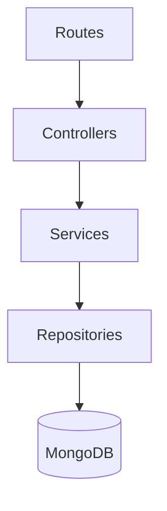
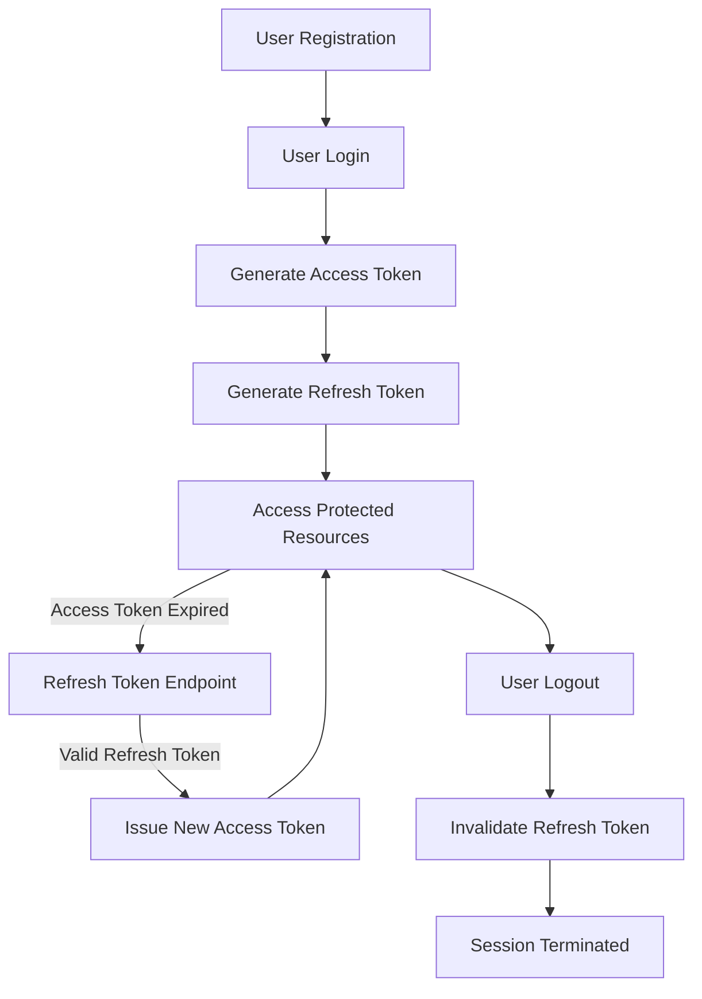
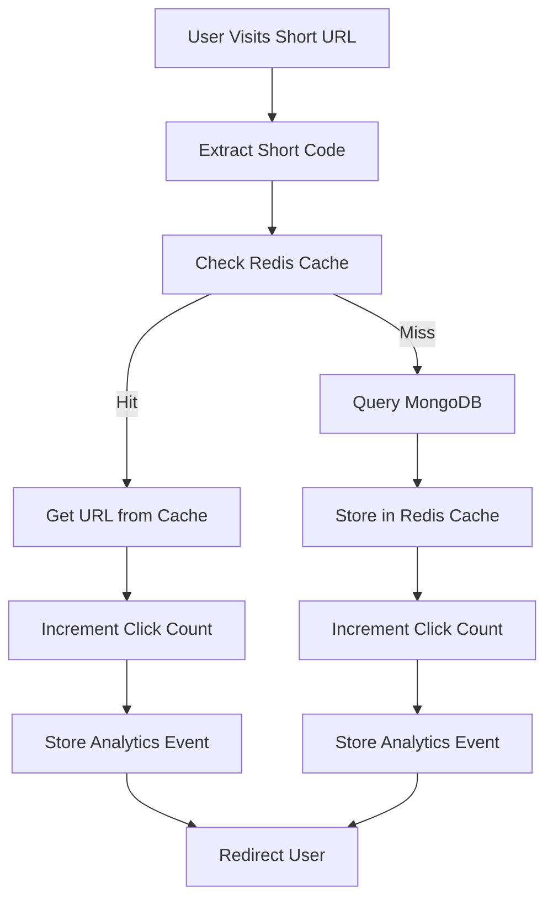
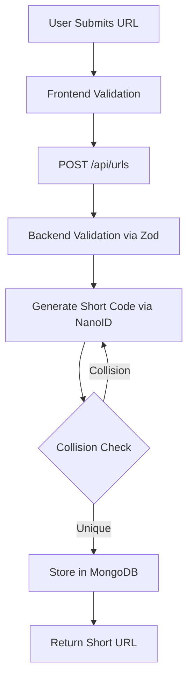
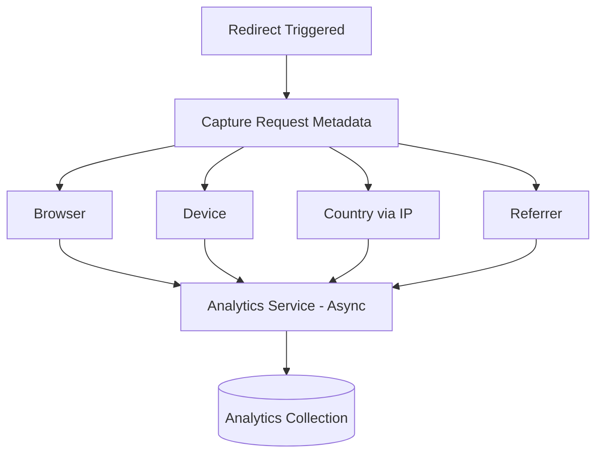
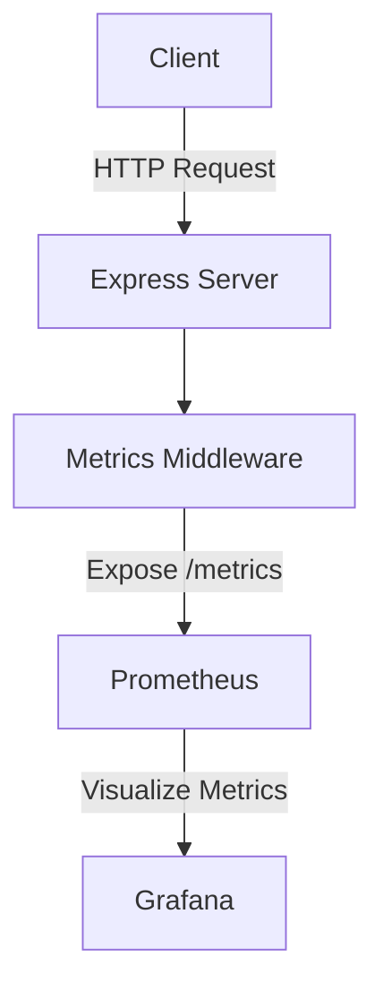
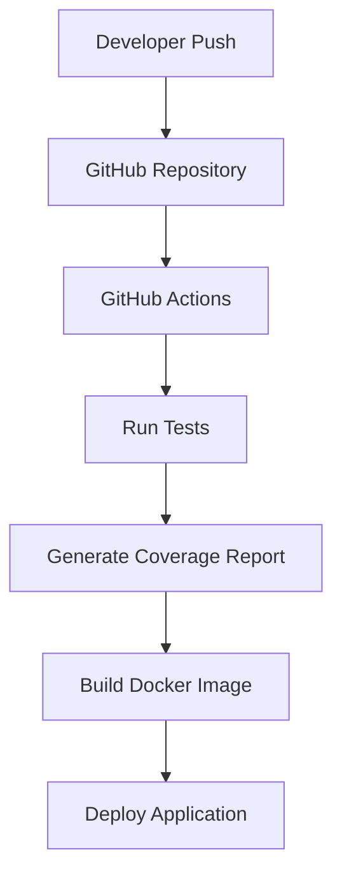
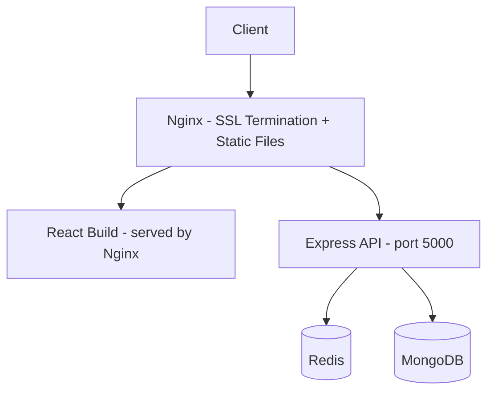

# URL Shortener

[](https://nodejs.org)
[](LICENSE)


A **production-oriented** URL shortening platform built with modern backend engineering practices. Create short links, manage URLs, track detailed analytics, and monitor performance through a clean dashboard.

---

## Highlights

- **JWT Authentication** with Access + Refresh Tokens
- **Redis-backed** URL caching for lightning-fast redirects
- **Advanced Analytics** with aggregation
- Fully **Dockerized** local development
- **CI/CD** with GitHub Actions
- **Swagger API Documentation**
- Automated Testing + Coverage Enforcement
- Clean **Layered Architecture** (Controller → Service → Repository)

---

## Tech Stack

### Backend

- Node.js + Express.js
- MongoDB
- Redis
- JWT + bcrypt
- Zod Validation
- Docker
- Vitest + Swagger

### Frontend

- React + TypeScript
- Vite
- React Query

---

## Production Features

- JWT Authentication
- Refresh Token Rotation
- RBAC
- Redis Caching
- Prometheus Metrics
- Health Checks
- Readiness Checks
- Graceful Shutdown
- Docker
- GitHub Actions
- Unit Tests
- Integration Tests

---

## Architecture Overview



---

## Table of Contents

- [Getting Started](#getting-started)
- [Environment Variables](#environment-variables)
- [Features](#features)
- [Architecture](#architecture)
- [API Reference](#api-reference)
- [Database Design](#database-design)
- [Deployment](#deployment)
- [Roadmap](#roadmap)

---

## Getting Started

### Prerequisites

- Node.js 18+
- Docker and Docker Compose
- MongoDB 6+ (or use the Docker setup)
- Redis 7+ (or use the Docker setup)

### Local Development (Docker)

```bash
# Clone the repository
git clone https://github.com/sayyed-anwar/url-shortener.git
cd url-shortener

# Copy environment files
cp backend/.env.example backend/.env
cp frontend/.env.example frontend/.env

# Start all services
docker compose up --build
```

Frontend: http://localhost:5173
Backend API: http://localhost:5000
MongoDB: localhost:27017
Redis: localhost:6379

### Manual Setup

```bash
# Backend
cd backend
npm install
npm run dev

# Frontend (new terminal)
cd frontend
npm install
npm run dev
```

---

## Environment Variables

### Backend (`backend/.env`)

| Variable             | Description                     | Example                                   |
| -------------------- | ------------------------------- | ----------------------------------------- |
| `PORT`               | Server port                     | `5000`                                    |
| `MONGODB_URI`        | MongoDB connection string       | `mongodb://localhost:27017/url-shortener` |
| `REDIS_URL`          | Redis connection string         | `redis://localhost:6379`                  |
| `JWT_SECRET`         | JWT signing secret              | `your-super-secret-key`                   |
| `JWT_REFRESH_SECRET` | Refresh token secret            | `your-refresh-secret-key`                 |
| `JWT_EXPIRES_IN`     | JWT expiry duration             | `15m`                                     |
| `BASE_URL`           | Public base URL for short links | `http://localhost:5000`                   |
| `NODE_ENV`           | Environment                     | `development`                             |

### Frontend (`frontend/.env`)

| Variable              | Description                          | Example                     |
| --------------------- | ------------------------------------ | --------------------------- |
| `VITE_API_URL`        | Backend API URL                      | `http://localhost:5000/api` |
| `VITE_SHORT_BASE_URL` | Base URL shown in UI for short links | `http://localhost:5000`     |

---

## Features

### Core

| Feature             | Description                                           |
| ------------------- | ----------------------------------------------------- |
| URL Shortening      | Convert long URLs into compact short links via NanoID |
| URL Redirection     | Redirect users with minimal latency via Redis cache   |
| Custom Aliases      | Let users choose their own short codes                |
| URL Expiration      | Expire links after a configurable date                |
| Link Management     | Create, edit, delete, and manage URLs                 |
| Click Tracking      | Track total link visits                               |
| Analytics Dashboard | View detailed statistics                              |

### Advanced

| Feature            | Description                                         |
| ------------------ | --------------------------------------------------- |
| Authentication     | JWT-based auth with bcrypt password hashing         |
| QR Code Generation | Generate QR codes for any short link                |
| Redis Caching      | Sub-millisecond lookups for hot URLs                |
| Rate Limiting      | Per-IP rate limiting via express-rate-limit         |
| Device Analytics   | Track device type per click                         |
| Browser Analytics  | Track browser per click                             |
| Geo Analytics      | Track country and city via IP geolocation           |
| Docker Support     | Full containerized setup via Docker Compose         |
| CI/CD Pipeline     | Automated testing and deployment via GitHub Actions |

---

## Architecture

### High-Level



### Backend Layers



### Authentication Flow



### URL Redirection Flow



> **Note:** Analytics logging is handled asynchronously after the redirect response is sent. This keeps redirect latency minimal even under high traffic.

### URL Creation Flow



### Analytics Collection Flow



---

## Quality Metrics

| Metric             | Value          |
| ------------------ | -------------- |
| Test Suites        | 8+             |
| Total Tests        | 50+            |
| Statement Coverage | 84%            |
| Branch Coverage    | 74%            |
| Function Coverage  | 71%            |
| CI/CD              | GitHub Actions |
| Containerized      | Docker         |

---

### Observability Flow



---

### Deployment Flow



---

## Project Structure

```text
url-shortener/
├── backend/
├── frontend/
├── docs/
├── docker/
├── .github/
├── docker-compose.yml
├── README.md
└── .gitignore
```

### Backend

```text
backend/
├── src/
│   ├── config/
│   │   ├── database.js         # MongoDB connection
│   │   ├── redis.js            # Redis client
│   │   └── env.js              # Environment variable validation
│   │
│   ├── controllers/            # Request/response handling
│   ├── services/               # Business logic
│   ├── repositories/           # Data access layer
│   ├── routes/
│   │   ├── auth.routes.js
│   │   ├── url.routes.js
│   │   ├── analytics.routes.js
│   │   └── redirect.routes.js  # /:shortCode, kept separate for performance
│   │
│   ├── middlewares/
│   │   ├── auth.middleware.js
│   │   ├── error.middleware.js
│   │   ├── validate.middleware.js
│   │   └── rateLimiter.middleware.js
│   │
│   ├── validators/             # Zod schemas
│   ├── models/                 # Mongoose models
│   ├── cache/
│   │   └── redisCache.js       # Cache get/set/invalidate helpers
│   │
│   ├── jobs/
│   │   ├── deleteExpiredUrls.job.js        # Cron: purge expired links
│   │   └── analyticsAggregation.job.js     # Cron: aggregate click stats
│   │
│   ├── utils/
│   │   ├── generateShortCode.js  # Short code generation
│   │   ├── extractDeviceInfo.js
│   │   ├── geoLocation.js
│   │   └── logger.js
│   │
│   ├── constants/
│   ├── app.js
│   └── server.js
│
├── tests/
│   ├── integration/
│   └── unit/
│
├── .env.example
├── .gitignore
├── package-lock.json
└── package.json
```

### Frontend

```text
frontend/
│
├── public/
│
├── src/
│   │
│   ├── api/
│   │   ├── axios.ts
│   │   └── queryClient.ts
│   │
│   ├── assets/
│   │   ├── images/
│   │   ├── icons/
│   │   └── logos/
│   │
│   ├── components/
│   │   ├── common/
│   │   ├── forms/
│   │   ├── analytics/
│   │   ├── layout/
│   │   └── url/
│   │
│   ├── pages/
│   │   ├── Home/
│   │   ├── Dashboard/
│   │   ├── Analytics/
│   │   ├── Login/
│   │   ├── Register/
│   │   └── NotFound/
│   │
│   ├── hooks/
│   │   ├── useAuth.ts
│   │   ├── useUrls.ts
│   │   └── useAnalytics.ts
│   │
│   ├── services/
│   │   ├── auth.service.ts
│   │   ├── url.service.ts
│   │   └── analytics.service.ts
│   │
│   ├── routes/
│   │   ├── AppRoutes.tsx
│   │   ├── ProtectedRoute.tsx
│   │   └── PublicRoute.tsx
│   │
│   ├── context/
│   │   └── AuthContext.tsx
│   │
│   ├── utils/
│   │   ├── copyToClipboard.ts
│   │   ├── formatDate.ts
│   │   └── generateQrCode.ts
│   │
│   ├── constants/
│   │   ├── api.ts
│   │   └── routes.ts
│   │
│   ├── styles/
│   │   └── index.css
│   │
│   ├── App.tsx
│   └── main.tsx
│
├── .env.example
├── .gitignore
├── index.html
├── package-lock.json
├── package.json
├── tsconfig.json
├── tsconfig.app.json
├── tsconfig.node.json
├── vite.config.ts
└── README.md
```

---

## Database Design

### Users

```json
{
  "_id": "ObjectId",
  "name": "string",
  "email": "string (unique, indexed)",
  "password": "string (bcrypt hash)",
  "createdAt": "Date"
}
```

### URLs

```json
{
  "_id": "ObjectId",
  "userId": "ObjectId (ref: Users)",
  "originalUrl": "string",
  "shortCode": "string (unique index, 7 chars, NanoID)",
  "customAlias": "string | null (unique sparse index)",
  "expiresAt": "Date | null",
  "clickCount": "number (default: 0)",
  "isActive": "boolean (default: true)",
  "createdAt": "Date"
}
```

### Analytics

```json
{
  "_id": "ObjectId",
  "urlId": "ObjectId (ref: URLs, indexed)",
  "country": "string",
  "city": "string",
  "browser": "string",
  "device": "string",
  "os": "string",
  "referrer": "string",
  "timestamp": "Date (TTL index: 90 days)"
}
```

> **Indexes:** `urlId + timestamp` compound index for analytics queries. TTL index on `timestamp` for automatic data expiry. `shortCode` unique index with partial filter for active URLs.

---

## API Reference

### Authentication

| Method | Endpoint             | Auth | Description        |
| ------ | -------------------- | ---- | ------------------ |
| POST   | `/api/auth/register` | —    | Create account     |
| POST   | `/api/auth/login`    | —    | Login, returns JWT |
| GET    | `/api/auth/profile`  | ✓    | Get current user   |

### URL Management

| Method | Endpoint        | Auth | Description                  |
| ------ | --------------- | ---- | ---------------------------- |
| POST   | `/api/urls`     | ✓    | Create short URL             |
| GET    | `/api/urls`     | ✓    | List user's URLs (paginated) |
| GET    | `/api/urls/:id` | ✓    | Get single URL               |
| PUT    | `/api/urls/:id` | ✓    | Update URL                   |
| DELETE | `/api/urls/:id` | ✓    | Delete URL                   |

### Analytics

| Method | Endpoint                   | Auth | Description                |
| ------ | -------------------------- | ---- | -------------------------- |
| GET    | `/api/analytics/:urlId`    | ✓    | Per-link analytics         |
| GET    | `/api/analytics/dashboard` | ✓    | Aggregated dashboard stats |

### Redirect

| Method | Endpoint      | Auth | Description                        |
| ------ | ------------- | ---- | ---------------------------------- |
| GET    | `/:shortCode` | —    | Redirect + async analytics capture |

---

## Redis Caching Strategy

Cache structure — key: `url:{shortCode}`, value: original URL string.

```bash
SET url:abc123 "https://example.com" EX 86400
```

- TTL: 24 hours (refreshed on each cache hit)
- On URL delete/update: cache key is invalidated immediately
- Cache miss triggers DB lookup and re-population

**Impact:** Redirects serve from Redis in ~1–2ms vs ~15–30ms from MongoDB.

---

## Security

| Layer            | Implementation                            |
| ---------------- | ----------------------------------------- |
| Authentication   | JWT                                       |
| Password Storage | bcrypt (rounds: 12)                       |
| Input Validation | Zod                                       |
| Rate Limiting    | express-rate-limit (100 req/15min per IP) |
| HTTP Security    | Helmet                                    |
| CORS             | Allowlisted origins via env config        |
| XSS Protection   | Input sanitization                        |

---

## Deployment

### Production Architecture



### Docker Compose

```bash
docker compose -f docker-compose.yml up -d
```

Services: `frontend`, `backend`, `mongo`, `redis`, `nginx`

### CI/CD

GitHub Actions pipeline on push to `main`:

1. Run unit and integration tests
2. Build Docker images
3. Push to registry
4. Deploy to server via SSH

---

## Scalability Notes

| Concern                | Current Approach                          | At Scale                                 |
| ---------------------- | ----------------------------------------- | ---------------------------------------- |
| Short code collisions  | NanoID + unique index + retry             | Acceptable at current scale              |
| High redirect traffic  | Redis caching layer                       | Add read replicas; consider CDN          |
| Analytics write volume | Async post-redirect logging               | Move to queue (BullMQ/Kafka) at 10k+ rps |
| MongoDB growth         | Separate analytics collection + TTL index | Horizontal sharding on `urlId`           |

---

## Observability

✔ Prometheus

✔ Health

✔ Readiness

✔ Structured Logging

✔ Request IDs

✔ Graceful Shutdown

✔ Metrics Endpoint

---

## Roadmap

### Completed

- [x] JWT Authentication
- [x] Refresh Token Rotation
- [x] URL CRUD
- [x] Redis Cache
- [x] Analytics Dashboard
- [x] Health & Readiness Endpoints
- [x] Prometheus Metrics
- [x] Graceful Shutdown
- [x] Docker
- [x] GitHub Actions CI
- [x] Swagger Documentation
- [x] Unit & Integration Tests

### Future

- [ ] Queue-based Analytics (BullMQ)
- [ ] Distributed Rate Limiting
- [ ] OpenTelemetry Tracing
- [ ] Kubernetes Deployment
- [ ] Multi-region Cache

---

## Documentation

Detailed architecture documentation is available in:

- `docs/architecture.md`
- `docs/authentication-flow.md`
- `docs/caching-strategy.md`
- `docs/database-design.md`

## License

MIT

---
