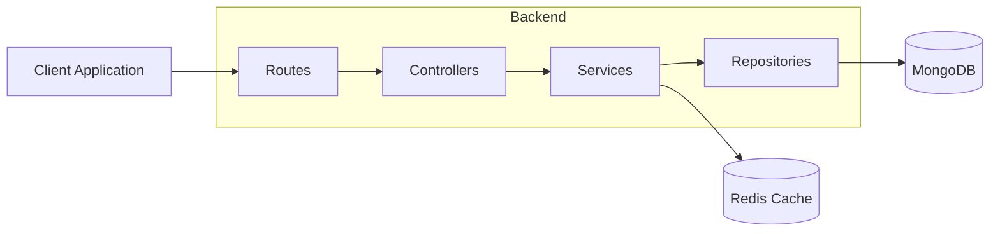
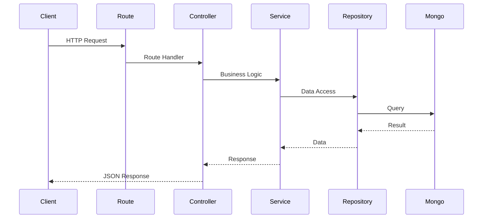

# System Architecture

## Overview

The URL Shortener is a production-oriented backend application designed to demonstrate modern backend engineering practices including authentication, caching, analytics, automated testing, CI/CD, and containerized deployments.

### Technology Stack

| Layer            | Technology             |
| ---------------- | ---------------------- |
| API              | Node.js, Express.js    |
| Database         | MongoDB                |
| Cache            | Redis                  |
| Authentication   | JWT + Refresh Tokens   |
| Validation       | Zod                    |
| Testing          | Vitest, Supertest      |
| Documentation    | Swagger                |
| Containerization | Docker, Docker Compose |
| CI/CD            | GitHub Actions         |

---

## High Level Architecture



---

## Request Lifecycle



---

## Architectural Principles

### Layered Architecture

The application follows a layered architecture:

- Routes handle endpoint definitions
- Controllers handle request/response concerns
- Services contain business logic
- Repositories manage data access

Benefits:

- Separation of concerns
- Improved testability
- Easier maintenance
- Clear dependency boundaries

---

### Why MongoDB?

MongoDB was selected because:

- Flexible document model
- Rapid iteration
- Fast development
- Natural fit for URL and analytics documents

---

### Why Redis?

Redis serves as the application's caching layer.

Benefits:

- Reduced database load
- Faster redirect performance
- Improved scalability

---

### Why JWT Authentication?

JWT provides:

- Stateless authentication
- Horizontal scalability
- API-friendly authorization model

---

### Why Docker?

Docker provides:

- Consistent environments
- Faster onboarding
- Simplified deployment workflows

```

```
