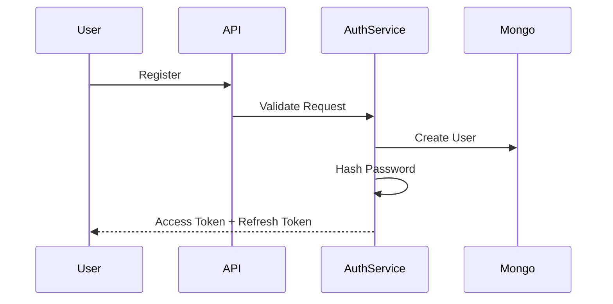
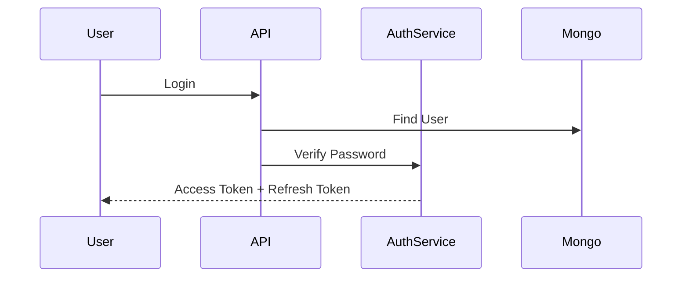
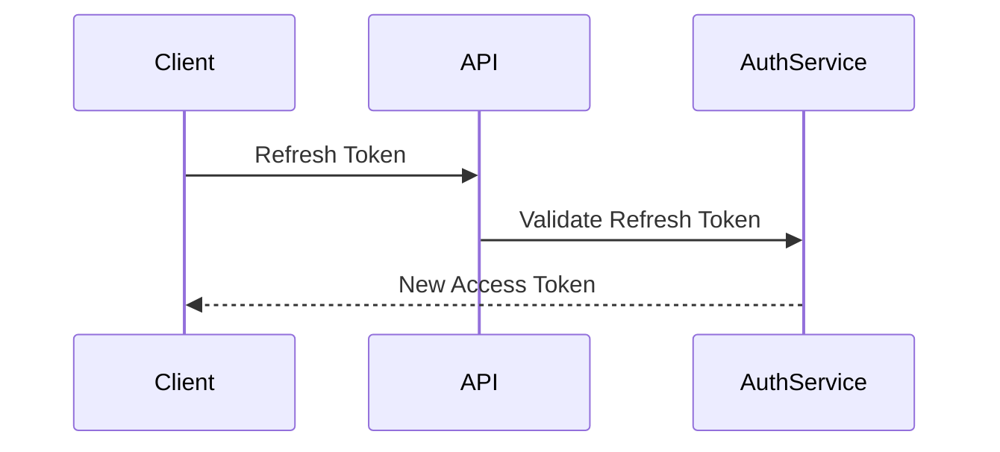
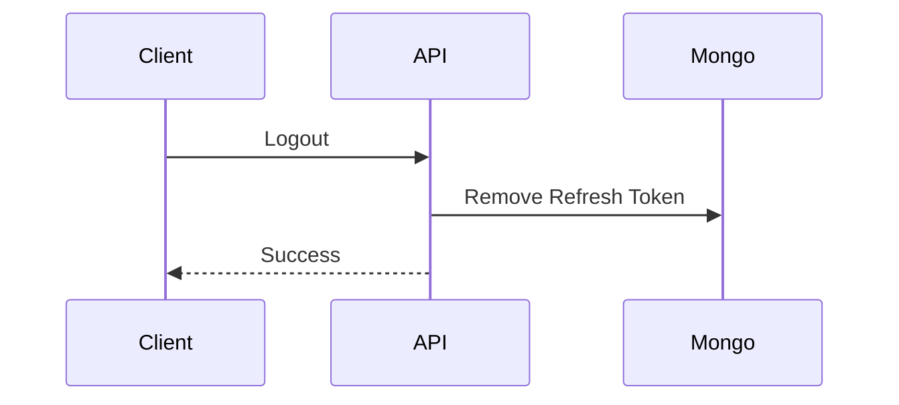

# Authentication Flow

## Registration

```mermaid
sequenceDiagram

participant User
participant API
participant AuthService
participant Mongo

User->>API: Register
API->>AuthService: Validate Request
AuthService->>Mongo: Create User
AuthService->>AuthService: Hash Password
AuthService-->>User: Access Token + Refresh Token
```

---

## Login

```mermaid
sequenceDiagram

participant User
participant API
participant AuthService
participant Mongo

User->>API: Login
API->>Mongo: Find User
API->>AuthService: Verify Password
AuthService-->>User: Access Token + Refresh Token
```

---

## Refresh Token Flow

```mermaid
sequenceDiagram

participant Client
participant API
participant AuthService

Client->>API: Refresh Token
API->>AuthService: Validate Refresh Token
AuthService-->>Client: New Access Token
```

---

## Logout

```mermaid
sequenceDiagram

participant Client
participant API
participant Mongo

Client->>API: Logout
API->>Mongo: Remove Refresh Token
API-->>Client: Success
```
