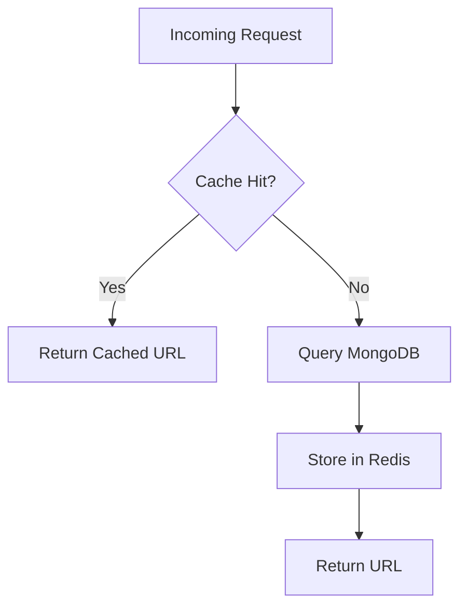

# Caching Strategy

## Redirect Cache Flow



---

## Cache Keys

```text
url:{shortCode}
```

Example:

```text
url:abc123
```

---

## Cache Invalidation

The cache is invalidated when:

- URL is updated
- URL is deleted
- URL expires

---

## Benefits

- Reduced MongoDB load
- Faster redirects
- Improved scalability
- Better user experience

```

```
