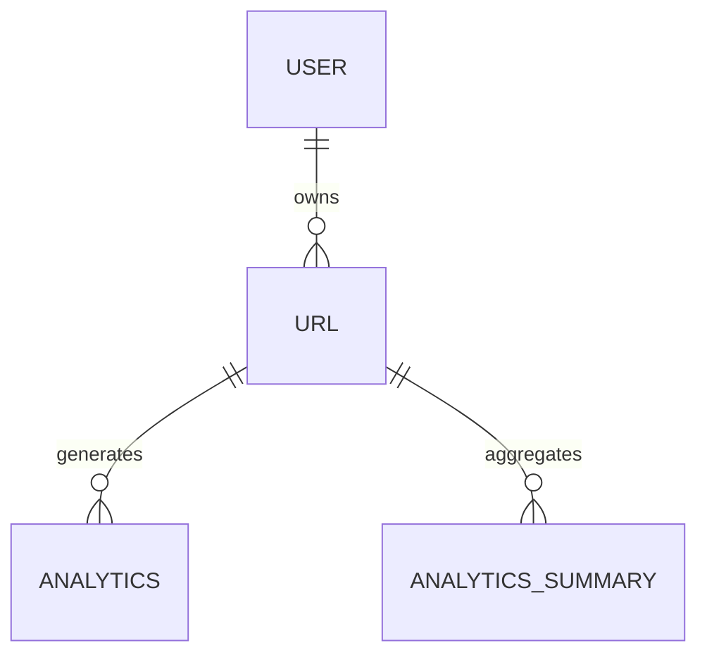
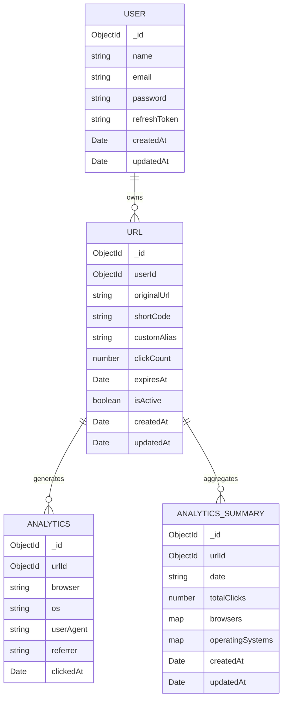
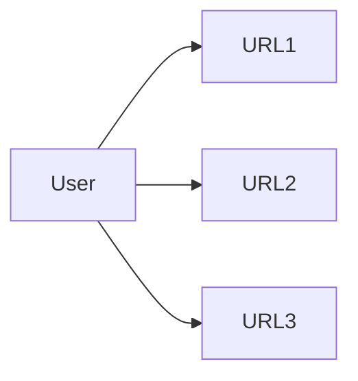
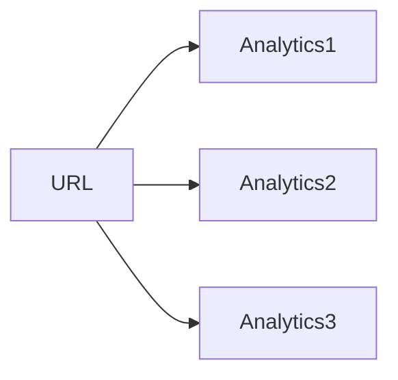
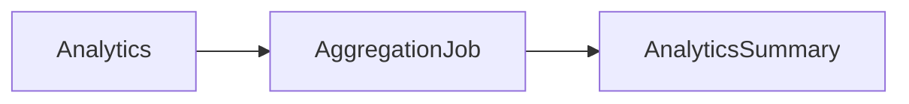
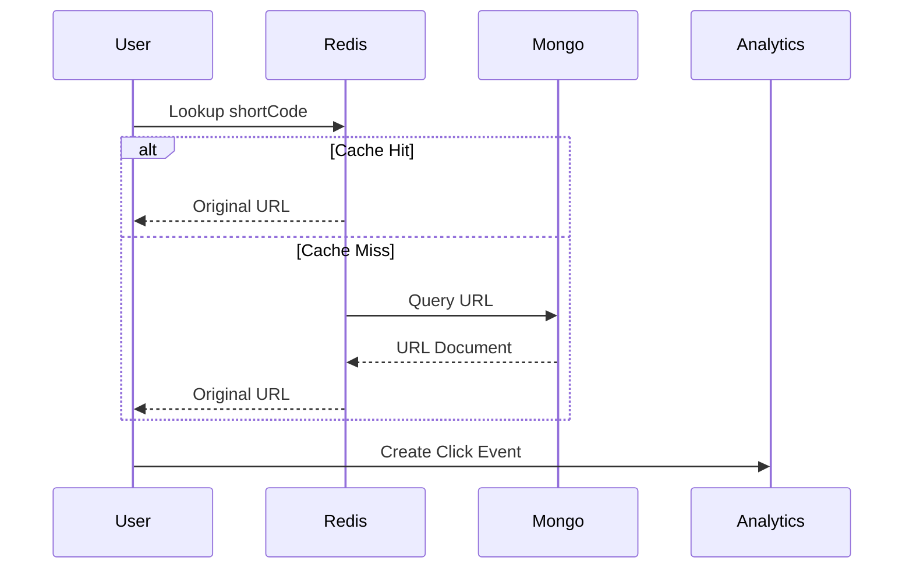

# Database Design

This document describes the database architecture for the URL Shortener platform.

The system uses MongoDB as its primary datastore and follows a document-oriented design optimized for low-latency URL redirects, analytics collection, and future horizontal scalability.

---

# Design Goals

The database architecture is designed to:

- Support millions of shortened URLs
- Provide fast short-code lookups
- Enable detailed click analytics
- Maintain strict URL ownership
- Support asynchronous analytics aggregation
- Minimize redirect latency
- Scale analytics workloads independently

---

# Collections Overview

The platform currently consists of four collections:



---

# Entity Relationship Diagram



---

# Users Collection

Stores authentication and account information.

## Schema

```json
{
  "_id": "ObjectId",
  "name": "John Doe",
  "email": "john@example.com",
  "password": "bcrypt_hash",
  "refreshToken": "jwt_refresh_token",
  "createdAt": "Date",
  "updatedAt": "Date"
}
```

## Indexes

```text
email (unique)
```

---

# URLs Collection

Stores shortened URLs and ownership metadata.

## Schema

```json
{
  "_id": "ObjectId",
  "userId": "ObjectId",
  "originalUrl": "https://example.com",
  "shortCode": "abc123",
  "customAlias": "my-link",
  "clickCount": 42,
  "expiresAt": null,
  "isActive": true,
  "createdAt": "Date",
  "updatedAt": "Date"
}
```

## Indexes

```text
shortCode (unique)
userId
```

---

# Analytics Collection

Stores individual click events.

Each redirect generates one analytics record.

## Schema

```json
{
  "_id": "ObjectId",
  "urlId": "ObjectId",
  "browser": "Chrome",
  "os": "Linux",
  "userAgent": "Mozilla/5.0 ...",
  "referrer": "google.com",
  "clickedAt": "Date"
}
```

## Indexes

```text
urlId
clickedAt
```

---

# Analytics Summary Collection

Stores pre-aggregated daily analytics generated by scheduled jobs.

This collection exists to reduce expensive aggregation queries on large analytics datasets.

## Schema

```json
{
  "_id": "ObjectId",
  "urlId": "ObjectId",
  "date": "2026-06-21",
  "totalClicks": 1240,
  "browsers": {
    "Chrome": 1000,
    "Firefox": 240
  },
  "operatingSystems": {
    "Linux": 500,
    "Windows": 740
  }
}
```

## Indexes

```text
urlId
date
(urlId + date) unique compound index
```

---

# Collection Relationships

## User → URL

One user can create multiple shortened URLs.



## URL → Analytics

Each redirect generates a separate analytics record.



## URL → Analytics Summary

Analytics records are periodically aggregated into summary documents.



---

# Redirect Data Flow



---

# Scaling Strategy

## URL Lookups

Optimizations:

- Unique shortCode index
- Redis caching layer
- O(1) redirect lookups

## Analytics Growth

Optimizations:

- Separate analytics collection
- Daily aggregation jobs
- Summary collection for dashboard queries

## Future Scaling

Potential enhancements:

- Redis Cluster
- MongoDB Sharding
- BullMQ Analytics Queue
- Event-Driven Analytics Pipeline

```

```
